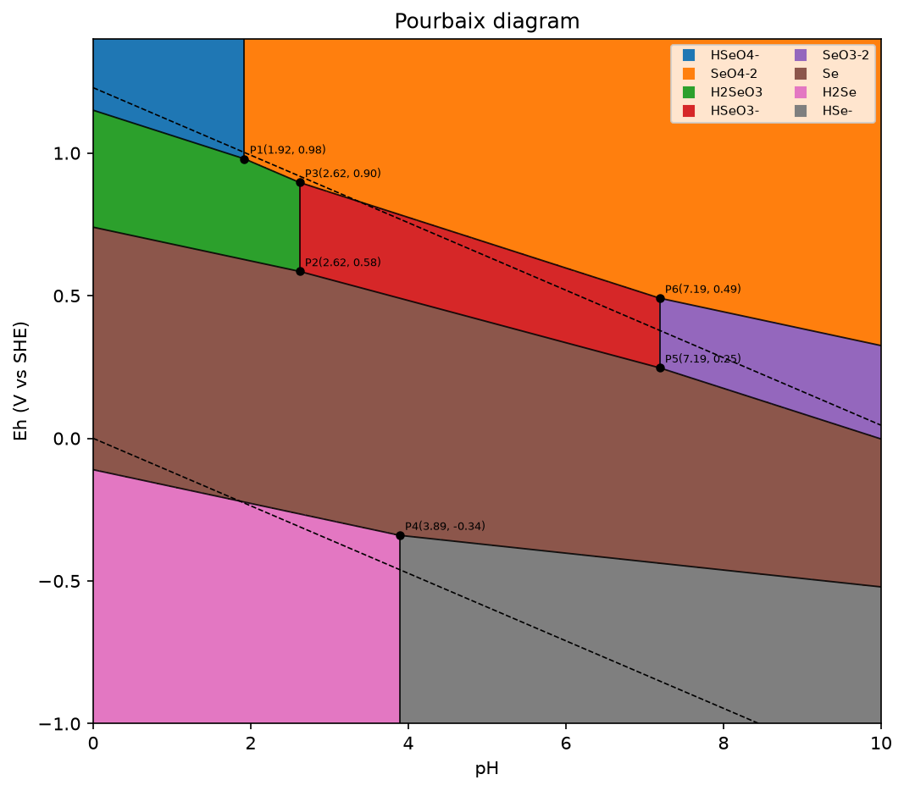
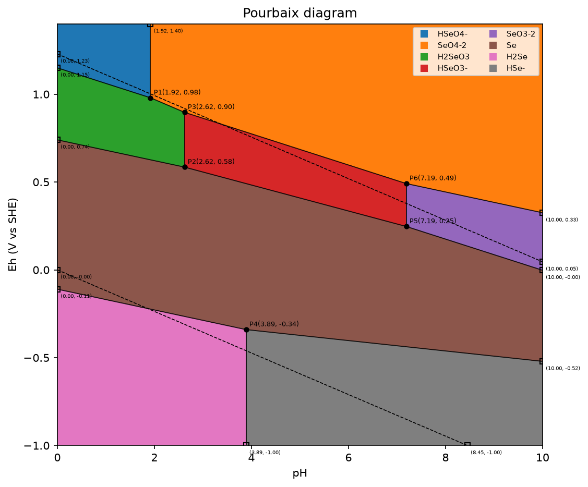
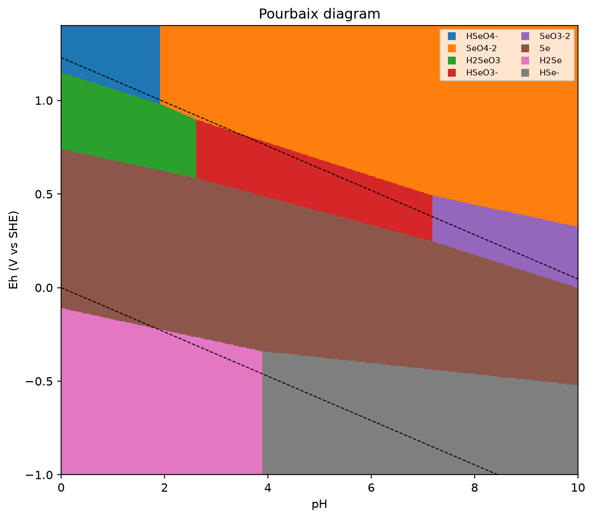
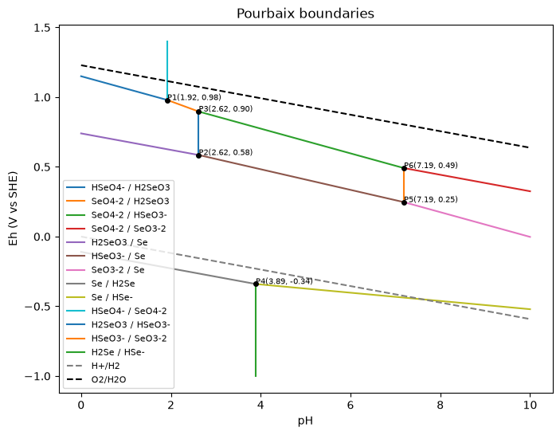
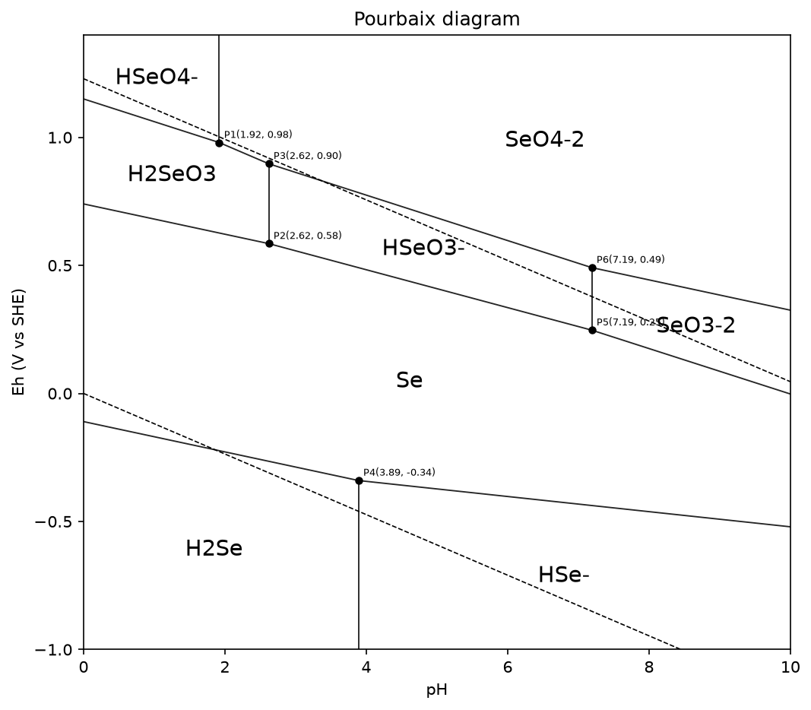
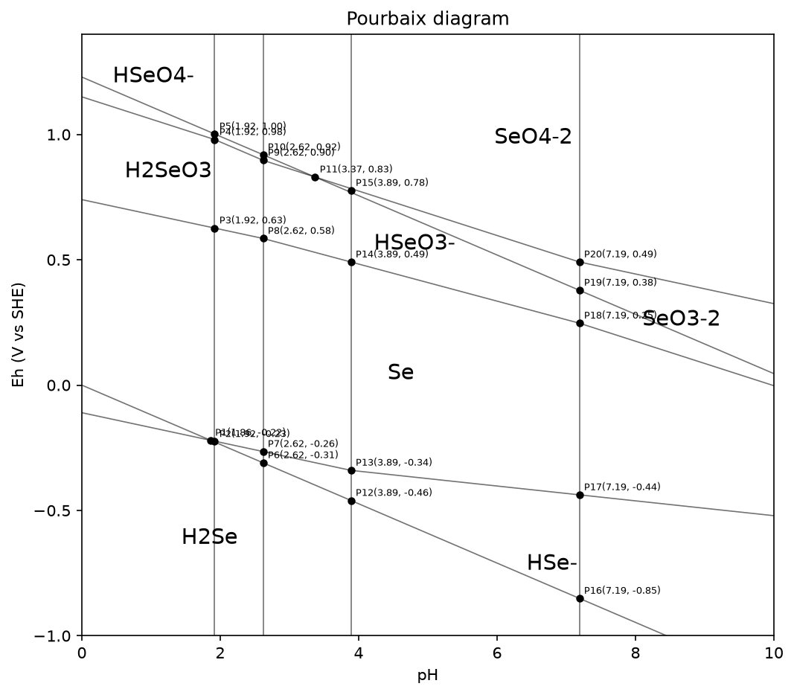
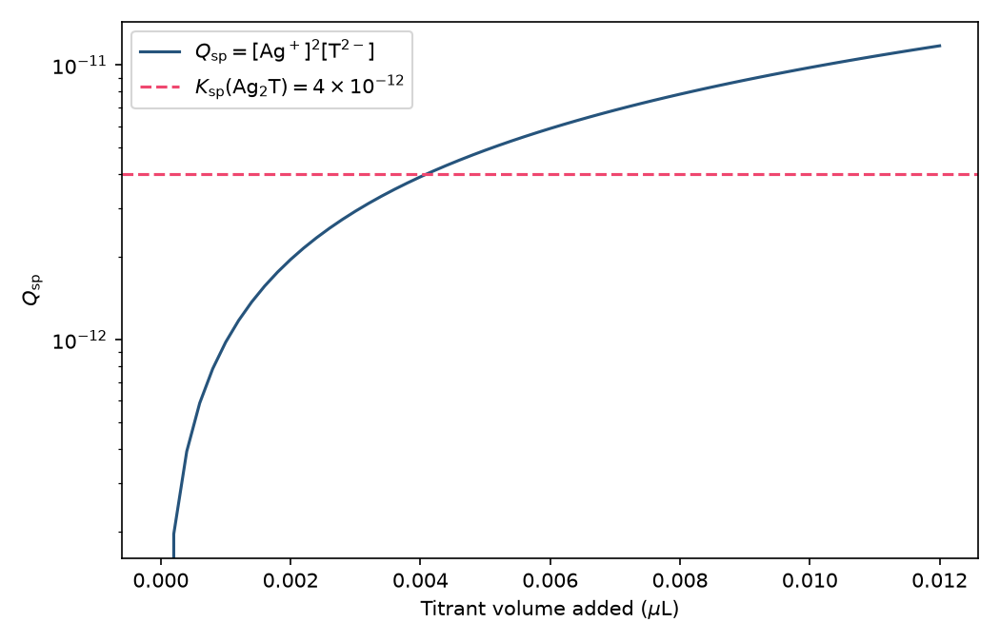
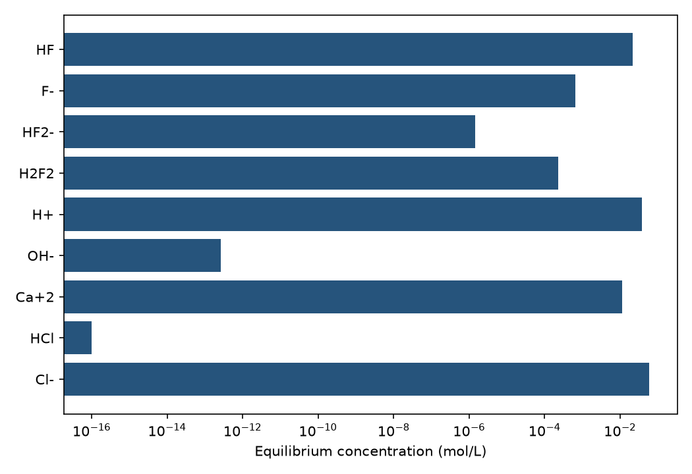
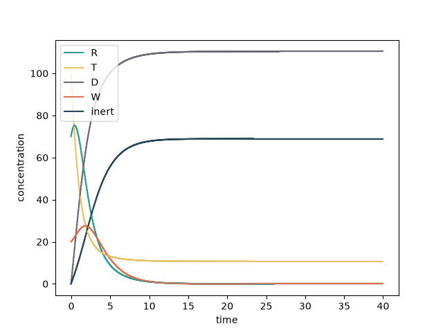

# ChemCompute

ChemCompute models multi-reaction chemical systems in Python. You define compounds and reactions once, wrap them in an `Enviroment`, and then run:

- **Equilibrium** — solve for concentrations where each reaction satisfies its mass-action expression (Q/K)
- **Kinetics** — integrate concentrations forward in time from rate laws
- **Titration** — mix a sample with a titrant over a volume grid and equilibrate at each step
- **Pourbaix** — map predominance vs pH and electrode potential

Both equilibrium and kinetics share the same reaction network, stoichiometry, and concentration state.

The figures below were produced by ChemCompute’s own `plot` methods (and, for equilibrium, a bar chart of `result.concentrations_dict`). Regenerate them with `python docs/generate_readme_figures.py`.

## Examples

### Selenium Pourbaix diagram

Selenium at 1 M total Se, pH 0–10, with the aqueous acid–base ladder and the HSeO4− / H2SeO3 / Se / H2Se redox chain.

```python
from ChemCompute import Enviroment, HalfReaction, Pourbaix, Reaction, XS

def ka(acid, base, pka):
    return Reaction.from_string(f"{acid} > H+ & {base}", K=10 ** (-pka))

env = Enviroment(
    Reaction.from_string("H2O.l > H+ & OH-", concentrations={"H2O": XS(0.0)}, K=1e-14),
    ka("HSeO4-", "SeO4-2", 1.92),
    ka("H2SeO3", "HSeO3-", 2.62),
    ka("HSeO3-", "SeO3-2", 7.19),
    ka("H2Se", "HSe-", 3.89),
    HalfReaction.from_string(
        "HSeO4- & 3_H+ & 2_@e = H2SeO3 & H2O.l", E0=1.15, name="HSeO4-/H2SeO3"
    ),
    HalfReaction.from_string(
        "H2SeO3 & 4_H+ & 4_@e = Se.s & 3_H2O.l", E0=0.74, name="H2SeO3/Se"
    ),
    HalfReaction.from_string("Se.s & 2_H+ & 2_@e = H2Se", E0=-0.11, name="Se/H2Se"),
    concentrations={"HSeO4-": 1.0},
    buffer=["H+"],
)

diagram = Pourbaix(
    env,
    pH_min=0.0,
    pH_max=10.0,
    Eh_min=-1.0,
    Eh_max=1.4,
    pH_steps=500,
    Eh_steps=500,
).run()

diagram.plot(plot_style="filled", save="selenium_filled.png", show=False)
diagram.plot(
    plot_style="filled",
    show_frame_intersections=True,
    save="selenium_frame.png",
    show=False,
)
diagram.plot_predominance(save="selenium_predominance.png", show=False)
diagram.plot_boundaries(save="selenium_boundaries.png", show=False)
diagram.plot(plot_style="labeled", save="selenium_labeled.png", show=False)
diagram.plot(
    plot_style="labeled",
    boundary_mode="all",
    save="selenium_all_boundaries.png",
    show=False,
)
```

**Filled** (default) colors each predominance region. **Frame intersections** marks where dominant-region boundaries meet the pH/Eh window. **Predominance** is the fill without junction markers. **Boundaries** is the line-only view with a couple legend. **Labeled** draws boundaries on white and writes the dominant species. **All boundaries** (`boundary_mode="all"`) draws every analytic line, not only borders between neighboring regions.

<p align="center">
  
  
</p>
<p align="center">
  
  
</p>
<p align="center">
  
  
</p>

### Precipitation titration (AgF / ammonium tartrate)

50 mL of 0.07 M AgF titrated with 0.01 M (NH4)2T. Precipitation of Ag2T (Ksp = 4e-12) is predicted when Qsp = [Ag+]^2 [T-2] crosses Ksp, near **0.0042 µL**.

```python
from ChemCompute import Enviroment, Reaction, Titration, XS
import numpy as np

agf = Enviroment(
    Reaction.from_string(
        "H2O.l > H+ & OH-",
        concentrations={"H2O": XS(55.5), "H+": 1e-7, "OH-": 1e-7},
        K=1e-14,
    ),
    Reaction.from_string("HF.aq > H+ & F-", K=10 ** (-3.1)),
    concentrations={"Ag+": 0.07, "F-": 0.07},
    volume=0.050,
)
titrant = Enviroment(
    Reaction.from_string("H2T > H+ & HT-", K=10 ** (-4.2)),
    Reaction.from_string("HT- > H+ & T-2", K=10 ** (-6.5)),
    Reaction.from_string("NH4+ > H+ & NH3", K=10 ** (-9.2)),
    Reaction.from_string("Ag+ & 2_NH3 > Ag(NH3)2+", K=2e7),
    concentrations={"NH4+": 0.02, "T-2": 0.01},
    volume=1.0,
)

volumes_ul = np.linspace(0.0, 0.012, 61)
curve = Titration(agf, titrant, volumes=volumes_ul * 1e-6).run(
    method="newton", tol=1e-10
)
qsp = curve.species("Ag+") ** 2 * curve.species("T-2")
```

<p align="center">
  
</p>

### Equilibrium (env 16)

HF / fluoride speciation in 0.06 M HCl with excess CaF2(s) and H2O(l). Excess solids and liquid water stay at activity 1; HCl is fully dissociated (`infinite_K`).

```python
from ChemCompute import Enviroment, Reaction, XS

env = Enviroment(
    Reaction.from_string("HF.aq & F-.aq > HF2-.aq", {}, K=0.1),
    Reaction.from_string("2_HF.aq > H2F2.aq", {}, K=0.5),
    Reaction.from_string("HF.aq > H+ & F-", {}, K=10 ** (-2.93)),
    Reaction.from_string(
        "H2O.l > H+ & OH-",
        {"H2O": XS(55.5), "H+": 1e-14 / 0.06},
        K=1e-14,
    ),
    Reaction.from_string("CaF2.s > Ca+2 & 2_F-", {"CaF2": XS(10.0)}, K=5e-9),
    Reaction.from_string("HCl.aq > H+ & Cl-", {"HCl": 0.06}, K=1.0, infinite_K=True),
)

result = env.equilibrium(method="newton", tol=1e-10, return_details=True)
print(result.concentrations_dict)
```

<p align="center">
  
</p>

### Kinetics (Jungle Model)

Autocatalytic growth of R on resource T, death of R to D, conversion of R into W, and death of W to inert:

```
R + T  ->  2R       k = 0.01
R      ->  D        k = 0.5
R + W  ->  2W       k = 0.01
W      ->  inert    k = 0.5
```

```python
from ChemCompute import Enviroment, Reaction

env = Enviroment(
    Reaction.from_string("R & T > 2_R", kf=0.01, kb=0.0, K=1e12),
    Reaction.from_string("R > D", kf=0.5, kb=0.0, K=1e12),
    Reaction.from_string("R & W > 2_W", kf=0.01, kb=0.0, K=1e12),
    Reaction.from_string("W > inert", kf=0.5, kb=0.0, K=1e12),
    concentrations={"R": 70.0, "T": 100.0, "W": 20.0},
)
env.kinetics(
    time=40.0,
    accuracy=0.05,
    plot="save",
    directory="jungle_model.png",
    colors=["#2a9d8f", "#e9c46a", "#6d6875", "#e76f51", "#264653"],
)
```

<p align="center">
  
</p>

---

## Installation

```bash
pip install chemcompute
```

From source:

```bash
git clone <repository-url>
cd ChemCompute
pip install -e .
```

Requires Python 3.7+, NumPy, and Matplotlib (for plots).

```python
from ChemCompute import Compound, Reaction, Enviroment, EquilibriumResult
```

---

## Build a reaction system

Every calculation starts with compounds, reactions, and an environment.

```python
from ChemCompute import Compound, Reaction, Enviroment

# Simple reversible reaction: A <=> B
rxn = Reaction.from_string(
    "A > B",
    concentrations=[1.0, 0.0],
    K=2.0,
    kf=0.5,
    kb=0.25,
)

env = Enviroment(rxn, T=298)  # Kelvin
```

Multiple reactions share compounds automatically:

```python
rxn1 = Reaction.from_string("A > B", [1.0, 0.0], K=2.0, kf=0.5, kb=0.25)
rxn2 = Reaction.from_string("B > C", [0.0, 0.0], K=1.5, kf=0.3, kb=0.2)

env = Enviroment(rxn1, rxn2, T=298)
env.concentrations = [1.0, 0.0, 0.0]  # [A, B, C]
```

Useful accessors:

| Property / method | Purpose |
|-------------------|---------|
| `env.compounds` | Ordered list of unique species |
| `env.concentrations` | Current molar concentrations |
| `env.concentrations_dict` | `{formula: concentration}` mapping |
| `env.compound_labels` | Formula strings aligned with concentration vectors |

Reactions can also be built with explicit reactant/product lists. See `tests/manual/manual_validation.py` for varied examples (phases, buffers, precipitation, coupled networks).

### Reaction string notation

Use `Reaction.from_string(...)` and `HalfReaction.from_string(...)` with a single grammar:

| Role | Token | Example |
|------|-------|---------|
| Species on one side | `&` | `HSeO4- & 3_H+ & 2_@e` |
| Reaction direction | `>` | `HA > H+ & A-` |
| Half-reaction sides | `=` | `Ox = Red` |
| Stoichiometry | prefix `n_` | `3_H+`, `2_@e` |
| Rate order (Reaction) | suffix `_n` | `A_2` (optional; default = stoichiometry) |
| Phase | suffix | `.aq`, `.s`, `.l`, `.g` |
| Electrons | `@e` only | never bare `e-` in Reaction |
| Live compound | `{water.token}` | keeps spectrum, phase, mp/bp |

Ionic charge is inferred from trailing `+` / `-` in species names (`H+`, `SeO4-2`, `Fe(CN)6-4`, `[Fe(CN)6]-4`). When compounds are added to an `Enviroment`, non-zero charges are copied into `env.charge_map` automatically (explicit `charge_map` entries still win at activity time).

**Concentrations** may be a `{formula: amount}` dict (missing species default to `0`) or a legacy ordered list. Mark excess species (fixed activity) with `XS(amount)` in reaction or environment concentration dicts; use bare `XS()` in `env.set_excess({...})` to keep the current amount.

```python
from ChemCompute import XS

kw = Reaction.from_string(
    "H2O.l > H+ & OH-",
    K=1e-14,
    concentrations={"H2O": XS(55.5), "H+": 0, "OH-": 0},
)
ka = Reaction.from_string("H2SeO3 > H+ & HSeO3-", K=10**-2.62, concentrations={"H2SeO3": 0, "H+": 0, "HSeO3-": 0})
hr = HalfReaction.from_string(
    "HSeO4- & 3_H+ & 2_@e = H2SeO3 & H2O.l",
    concentrations=[1.0, 0, 0, 0],
    E0=1.15,
)
env = Enviroment(kw, ka, hr, concentrations={"HSeO4-": 1.0}, buffer=["H+"])
env.set_excess({"H2O": XS()})  # optional env-level excess override
```

To keep a Compound you already built (library entry with spectrum, mp, bp), interpolate `.token` — not `f"{water()}"`, which still prints the formula:

```python
from ChemCompute.compounds import water

kw = Reaction.from_string(
    f"{water().token} > H+ & OH-",
    concentrations={"H2O": XS(55.5)},
    K=1e-14,
)
assert kw.reactants[0]["compound"] is water()
```

**Migration:** replace `+` between species with `&` (e.g. `A + B > C` → `A & B > C`; `Fe+3 + @e = Fe+2` → `Fe+3 & @e = Fe+2`).

---

## Environment construction and mixing

### Three ways to build an environment

```python
# 1) Classic — reactions only (concentrations summed from reactions)
env = Enviroment(rxn1, rxn2, T=298, volume=1.0)

# 2) Compounds only — no reaction network
env = Enviroment.from_compounds({"Na+": 0.1, "Cl-": 0.1}, volume=1.0)

# 3) Reactions + concentration overrides (dict wins over reaction values)
env = Enviroment(
    rxn1, rxn2,
    concentrations={"H+": 0.06, "Ca+2": 0.01},
    volume=0.1,
)
```

`volume` is in litres (default `1.0`) and is used when mixing environments.

### Standalone reaction solvers

```python
rxn = Reaction.from_string("A > B", [1.0, 0.0], K=2.0, kf=0.5, kb=0.25)
final = rxn.equilibrium(method="newton", tol=1e-10)
traces = rxn.kinetics(time=5.0, accuracy=1e-3)
```

### Mix environments (volume-weighted)

```python
envA = Enviroment(rxn_a, concentrations={"A": 1.0}, volume=1.0)
envB = Enviroment.from_compounds({"B": 0.1}, volume=1.0)

envC = envA + envB                         # volume = 2.0
envD = 0.5 * envA + 4 * envB               # effective volume = 4.5 L
envE = Enviroment.combine((0.5, envA), (4, envB))  # same as envD

envF = envC.add_compounds({"A": 1.0}, volume=1.0)
envG = envC.add_compounds({"A": 1.0}, volume=1.0, coefficient=4.0)
```

Mixing rule: `effective_volume = coeff × volume`, total moles per species are conserved, final concentration = moles / total effective volume.

### Constant pH / buffering

Hold pH fixed during equilibrium or kinetics by setting `[H⁺]` and marking it as buffered. ChemCompute keeps buffered species at their initial concentration (after `concentrations=` overrides) while other species react freely. Buffered species still appear in Q/K mass-action terms.

```python
env = Enviroment(
    weak_acid_rxn, water_autoionization,
    concentrations={"H+": 1e-7},   # pH 7
    buffer=["H+"],                 # hold [H+] constant during the solve
)

env.apply_equilibrium(method="newton")
env.kinetics(time=10.0, accuracy=1e-3)  # [H+] stays 1e-7 M
```

For basic media, fix `[OH⁻]` instead: `concentrations={"OH-": 1e-2}, buffer=["OH-"]`.

Explicit targets are optional: `buffer={"H+": 1e-7}`. Use `env.set_buffer(["H+"])` to re-snapshot after changing concentrations.

This **enforces** constant concentration during the solve. `env.buffer_diagnostics()` only **reports** buffer capacity β(pH) after a calculation—it does not fix pH. Excess species (`XS(...)` on a reaction or environment concentration entry) fix amount during the solve; solids/liquids are omitted from Q by phase. Buffered H⁺ stays in Q at its fixed value.

---

## Equilibrium calculation

`env.equilibrium()` finds concentrations that satisfy all finite-K reactions simultaneously. It minimizes a loss on ln(Q/K) (or related metrics) subject to non-negative concentrations.

### Basic usage

```python
# Returns a concentration list (same order as env.compounds)
equilibrium = env.equilibrium(method="newton", tol=1e-10)

# Or return full diagnostics
result = env.equilibrium(method="newton", tol=1e-10, return_details=True)
print(result.concentrations_dict)
print(result.criterion_met)   # Did the solver meet its stopping criterion?
print(result.stop_reason)     # e.g. "residual_tol", "quotient_error_limit"
```

Apply the solution back onto the environment:

```python
result = env.apply_equilibrium(method="newton", tol=1e-10)
# env.concentrations is now updated; details in env.last_equilibrium_result
```

### Methods and stopping criteria

| Parameter | Options | Role |
|-----------|---------|------|
| `method` | `"bgd"`, `"sgd"`, `"newton"` | Optimizer (Newton is usually best for stiff/speciation systems) |
| `loss` | `"log_quotient"`, `"quotient_error"`, `"log_huber"` | What to minimize |
| `tol` | float | Residual tolerance (default when `quotient_error_limit` is not set) |
| `quotient_error_limit` | float, e.g. `0.01` | Stop when every reaction has \|Q/K − 1\| ≤ limit (overrides `tol`) |
| `max_iter`, `learning_rate` | — | Iteration control (defaults depend on method) |
| `min_concentration` | float | Floor used only for log safety on zero/negative values |

**Diagnostics** (with `return_details=True` or via `env.last_equilibrium_result`):

- `reaction_quotient_error` — per-reaction \|Q/K − 1\|
- `reaction_quotient_ratio` — per-reaction Q/K (1.0 means equilibrium for that reaction)
- `reaction_extents` — stoichiometric extent vector (informational)
- `criterion_met`, `criterion_type`, `criterion_value`, `criterion_limit`

### Phases, Kw, and Ksp

Solid (`s`) and liquid (`l`) species are **omitted from Q** with **activity = 1**, matching standard thermodynamic practice:

- Water autoionization: **Kw = [H⁺][OH⁻] = K** — H₂O does not appear in Q or K
- Solid solubility: **Ksp = [Ca²⁺][F⁻]²** — the pure solid does not appear in Q or K

Only `aq` and `g` species participate in the mass-action product Q.

```python
from ChemCompute import XS

kw = Reaction.from_string(
    "H2O.l > H+ & OH-",
    concentrations={"H2O": XS(55.5), "H+": 1e-7, "OH-": 1e-7},
    K=1e-14,
)
ksp = Reaction.from_string(
    "CaF2.s > Ca+2 & 2_F-",
    concentrations={"CaF2": XS(10.0)},
    K=5e-9,
)
env = Enviroment(kw, ksp)
# Excess lives next to concentration: reaction entries and env.compounds_concentration / env.excess_dict
```

`XS(amount)` keeps that species' concentration **fixed** during the solve (large reservoir of solid or solvent). It does not multiply K by the bulk molarity. Phase `s`/`l` still omit the species from Q (activity 1).

### Advanced reaction options

```python
# Strong acid fully dissociated — treated as irreversible (excluded from Q/K residual)
Reaction(..., infinite_K=True)

# Direct initialization with explicit Compound objects and non-unity stoichiometry
Reaction(reactants, products, reactants_concentration, products_concentration, K=..., kf=..., kb=...)
```

Complex reference environments (env16–env20) live in `tests/manual/complex_environments.py`. Regenerate their reference concentrations with:

```bash
python tests/manual/generate_expected.py
```

---

## Kinetic simulation

`env.kinetics()` integrates the mass-action rate laws forward in time using the current concentrations and rate constants `kf` / `kb`.

### Basic usage

```python
results = env.kinetics(
    time=10.0,           # total simulation time
    accuracy=1e-3,       # time step
    checkpoint_time=[1.0, 5.0, 10.0],
)

# results is a list of concentration snapshots at checkpoints (and final time)
final = results[-1]
```

### Plotting

```python
env.kinetics(
    time=10.0,
    plot="interactive",  # or "save" or False
    directory="./plot.png",
    colors=["#26547c", "#ef476f"],  # one color per compound; optional
)
```

Kinetics uses the same `env.concentrations` as the starting point. Run equilibrium first if you want to integrate from an equilibrated state:

```python
env.apply_equilibrium(method="newton", tol=1e-10)
env.kinetics(time=5.0, plot="save", directory="approach.png")
```

---

## Temperature-dependent K and k

Pass enthalpy, entropy, and activation energies when defining a reaction. Changing `rxn.T` or `env.T` updates **K** (van't Hoff) and **kf** / **kb** (Arrhenius):

```python
rxn = Reaction.from_string(
    "A > B",
    K=2.0, kf=0.5, kb=0.25,
    enthalpy=-50000,
    activation_energy_forward=50000,
    activation_energy_backward=100000,
    T=298,
)
rxn.T = 350  # K, kf, kb recalculate automatically
```

When `entropy` is set, full van't Hoff uses ΔG = ΔH − TΔS. Disable automatic updates:

```python
env = Enviroment(rxn, adjust_thermodynamics=False)
env.T = 350  # K, kf, kb unchanged
```

---

## Ionic activity model

Correct Q/K at non-negligible ionic strength with Debye–Hückel, Davies, or Pitzer-lite:

```python
from ChemCompute import ActivityModel

env = Enviroment(rxn, activity_model="davies")
env.charge_map = {"Ca2+": 2, "F-": -1}  # overrides auto-inferred Compound.charge
# or: Compound("Na+", charge=1, ...)
```

Activity coefficients are applied in `equilibrium()` when computing Q.

---

## Buffer diagnostics

After equilibrium, compute buffer capacity β(pH) and Henderson–Hasselbalch checks:

```python
from ChemCompute import buffer_diagnostics

diag = env.buffer_diagnostics()  # uses current concentrations
# diag.pH, diag.beta, diag.buffer_pairs, diag.hh_predictions
```

---

## Titration

Mix a **sample** environment with a **titrant** environment over a range of titrant volumes, equilibrate at each step, and collect concentrations vs volume added.

```python
from ChemCompute import Titration, Enviroment

sample = Enviroment(...)  # analyte; set sample.volume (e.g. 0.1 L)
titrant = Enviroment.from_compounds({"OH-": 0.1, "Na+": 0.1}, volume=1.0)

curve = Titration(
    sample,
    titrant,
    volume_min=0.0,
    volume_max=0.05,
    steps=100,
).run(method="newton", tol=1e-10)

# Access data
curve.titrant_volumes          # L added at each step
curve.pH
curve.matrix()                 # shape (n_steps, n_compounds)
curve.species("H+")            # one species vs volume
curve.speciation               # list of {formula: c} per step

# Plot
curve.plot(species=["H+", "OH-"], plot="save", directory="titration.png")
curve.plot_pH(plot="interactive")
```

Pass an explicit volume list with ``volumes=[0, 0.001, 0.002, ...]`` instead of ``volume_min``/``volume_max``/``steps``.

The sample and titrant are not mutated. Mixing uses the same volume-weighted rules as ``envA + envB``.

---

## UV–Vis (Beer–Lambert)

Molar absorptivity is a property of the compound. User-supplied points use piecewise-linear interpolation:

```python
from ChemCompute import Compound, SpectrumSpec, uvvis_spectrum

inh = Compound(
    "InH",
    spectrum=SpectrumSpec(
        points=[(400e-9, 12000), (450e-9, 25000), (500e-9, 8000)],
        extrapolate="flat",  # or "none" for zero epsilon off-tabulated wavelengths
    ),
)
# After parsing a reaction string, attach by formula:
# env.set_spectrum("InH", SpectrumSpec(...))
A = uvvis_spectrum(env, wavelengths=[450e-9, 500e-9], path_length=0.01)
```

A library of common molecules, ions, and complexes lives in `ChemCompute.compounds`. Each name is a function that returns the shared compound. Melting and boiling points are in kelvin. UV-Vis data (where a clear aqueous envelope exists) are stored as connected (wavelength, ε) points — a piecewise-linear trace, not a single λmax spike. The default 0.01 m path length is a 1 cm cuvette:

```python
from ChemCompute import Reaction, uvvis_spectrum
from ChemCompute.compounds import water, h_plus, oh_minus, mno4, fescn

rxn = Reaction.from_string(
    f"{water().token} > {h_plus().token} & {oh_minus().token}",
    concentrations=[1.0, 1e-7, 1e-7],
    K=1e-14,
)
# mno4().spectrum traces the permanganate visible band (peak 525 nm);
# fescn() is the FeSCN²⁺ LMCT envelope (peak 447 nm)
A = uvvis_spectrum(env, wavelengths=[500e-9, 525e-9, 550e-9], path_length=0.01)
```

Look up a species with `compounds.get("H2O")`. `water()` always returns the same object.

---

## Reaction library

`ChemCompute.reactions` names are functions that return the shared `Reaction` (same idea as `compounds`). Each has a tabulated `K` (or `infinite_K` for strong acids / analytical redox) and **every concentration 0**. Set amounts on the environment:

```python
from ChemCompute import Enviroment
from ChemCompute.reactions import water_kw, acetic_acid, agcl_ksp, fescn_kf

env = Enviroment(
    water_kw(),
    acetic_acid(),
    agcl_ksp(),
    fescn_kf(),
    concentrations={"CH3COOH": 0.10, "Ag+": 1e-3},
)
```

Included groups: water / weak and strong acids and bases, Ksp dissolution of common salts, overall complex formation (FeSCN²⁺, ammines, ferroin, triiodide, hexacyanoferrates), and a few irreversible redox titrations. Solids and liquid water are library compounds (activity 1, omitted from Q). `water_kw()` always returns the same reaction.

---

## Half-reaction library

`ChemCompute.half_reactions` names are functions that return the shared `HalfReaction`. Each has a tabulated E° vs SHE (25 °C) and **every concentration 0**. Set amounts on the environment:

```python
from ChemCompute import Enviroment
from ChemCompute.half_reactions import hydrogen, oxygen, iron_iii, permanganate

env = Enviroment(
    hydrogen(),
    oxygen(),
    iron_iii(),
    concentrations={"Fe+3": 0.01, "Fe+2": 0.001},
    buffer=["H+"],
)
```

Included groups: water window (H⁺/H₂, O₂/H₂O, peroxide), halogen/halide, metal ions (Fe³⁺/Fe²⁺, Cu, Ag, Zn, …), oxoanions (MnO₄⁻, Cr₂O₇²⁻, NO₃⁻), and hexacyanoferrate. Library ions and liquid water are reused via `.token`. Metal solids are `M.s`. `hydrogen()` is the SHE (E° = 0); `she` is the same function.

---

## Environment library

`ChemCompute.environments` couples related library reactions and half-reactions into a fresh `Enviroment` (concentrations start at 0). Polyprotic acids include every deprotonation plus Kw. Silver chloride includes both AgCl(s) precipitation and AgCl2- formation. `water_limits` is the O₂/H₂O and H⁺/H₂ window with Kw; `daniel_cell` is Cu²⁺/Cu with Zn²⁺/Zn:

```python
from ChemCompute.environments import phosphoric_acid, silver_chloride, copper_hydroxide_ammine, water_limits

h3po4 = phosphoric_acid(concentrations={"H3PO4": 0.10})
agcl = silver_chloride(concentrations={"Ag+": 1e-3, "Cl-": 0.10})
cu = copper_hydroxide_ammine(concentrations={"Cu+2": 0.01, "NH3": 1.0})
window = water_limits()
```

Each call returns an environment that uses the library reactions, half-reactions, and compounds directly (`water()`, `water_kw()`, `agcl()`, `hydrogen()` are the same objects every time). Amounts live on that environment.

---

## Enzyme kinetics

Michaelis–Menten and inhibition models integrate via `env.kinetics()` when bio rate laws are present:

```python
from ChemCompute import single_substrate_mm, competitive_inhibition

env = single_substrate_mm(s0=1.0, Vmax=1e-5, Km=1e-4)
checkpoints = env.kinetics(time=100.0, accuracy=0.01)

env = competitive_inhibition(s0=1.0, i0=0.2, Ki=1e-4)
```

Templates: `single_substrate_mm`, `competitive_inhibition`, `uncompetitive_inhibition`, `noncompetitive_inhibition`, `mixed_inhibition`, `sequential_pathway`.

---

## Testing

```bash
pytest tests/
python tests/manual/manual_validation.py   # 20 named equilibrium/kinetics cases
```

See also `tests/test_environment.py` for equilibrium, composition, buffering, titration, half-reactions, Pourbaix, activity, UV–Vis, and bio kinetics.

Kinetic plots from manual validation are written to `manual_test_output/kinetics/`.

---

## Half-reactions and Pourbaix diagrams

Half-reactions use **`@e`** as the electron token (never `e` or `e-` in `Reaction` strings). Species and concentrations mirror `Reaction`:

```python
from ChemCompute import Compound, Enviroment, HalfReaction, Pourbaix

hr = HalfReaction.from_string(
    "Fe+3 & @e = Fe+2",
    concentrations=[0.01, 0.001],  # [Fe+3], [Fe+2] — no slot for @e
    E0=0.771,
)

env = Enviroment(
    hr,
    concentrations={"H+": 1e-7},
    buffer=["H+"],
)

env.set_electrode_potential(Eh=0.44)  # fixed E (V vs SHE)
env.equilibrium()

E = hr.E_at(env)  # Nernst E from concentrations

diagram = Pourbaix(env, pH_steps=30, Eh_steps=30).run()
diagram.plot(save="pourbaix.png", show=False)
diagram.plot(plot_style="labeled", save="pourbaix_labeled.png", show=False)
print(diagram.junction_points[:3])  # species-labeled coordinates in model mode
```

### Speciation methods

| Method | Speed | Saved geometry | Use when |
|--------|-------|----------------|----------|
| `model` (default) | Fast | Analytic boundaries + junction points (`geometry_source='analytic'`) | Connected redox ladder per element, known E°/K/pKa, fixed `element_totals` |
| `equilibrium` | Slow | Dominance grid matrix (`geometry_source='grid'`) | Full coupling, stiff networks, or reactions not parsed by the graph model |

**Grid steps by method:**

| Parameter | `model` | `equilibrium` |
|-----------|---------|---------------|
| `pH_steps`, `Eh_steps` | Region neighbors + fill/labels; ~25–40 for smooth fill | Region layout **and** boundaries; finer = slower |
| `geometry_pH_steps` | Analytic line sampling (default 200); independent of fill | N/A |

**Plot styles:** `plot_style="filled"` (default) colors each region. `plot_style="labeled"` draws boundaries on a white background and writes the dominant species in each region (font scales with region size; coarser `pH_steps`/`Eh_steps` is usually enough).

**Junction points:** numbered `P1`, `P2`, … — dominant-region coords via `diagram.junction_table()` (default) or full analytic set via `junction_table(source="analytic")`. Plot default: `boundary_mode="dominant"` (smooth clipped lines between neighboring regions, including vertical pH lines); use `boundary_mode="all"` for every analytic boundary.

**Model limits:** ideal dilute Nernst + pKa; independent per-element chains; oligomer/Ksp regions depend on totals and parsed reaction patterns; no cross-element redox.

```python
from ChemCompute import Pourbaix, build_pourbaix_graph

graph = build_pourbaix_graph(env)
diagram = Pourbaix(env, element_totals={"Se": 1.0}, speciation_method="model").run()
for junction in diagram.junction_points:
    print(junction.label, junction.pH, junction.Eh)
```

Complex syntax uses `=`, `&`, and `@e`:

```python
HalfReaction.from_string(
    "Fe(OH)3.s & 3_H+ & @e = Fe+2 & 3_H2O.l",
    concentrations=[1.0, 1e-7, 0.05, 1.0],
    E0=-0.55,
)
```

Pass half-reactions directly to `Enviroment(rxn1, hr1, hr2, ...)`. With **two or more** half-reactions and no imposed `electrode_Eh`, equilibrium solves a **shared electrode potential** jointly with concentrations.

**Phase rules:** only explicit `.s` / `.l` solids and liquids are omitted from Q (activity 1). Undetermined phase stays in Q at concentration.

---

## Project layout

```
src/ChemCompute/
  _general.py      Compound, Reaction, Enviroment
  _equilibrium.py  Equilibrium solver and EquilibriumResult
  _kinetics.py     Time integration and plotting
  _activity.py     Ionic activity coefficients
  _buffer.py       Buffer capacity and Henderson-Hasselbalch
  _buffering.py    Solver-side constant-pH / species buffering
  _mixing.py       Environment combine and ScaledEnviroment
  _titration.py    Titration curves (sample + titrant environments)
  _half_reaction.py HalfReaction, Nernst electrode potential coupling
  _pourbaix.py     Pourbaix diagram scanner and PourbaixResult
  _uvvis.py        Beer-Lambert spectra
  _bio_kinetics.py Michaelis-Menten and inhibition integrator
  bio_templates/   Premade enzyme-kinetics environments
  compounds/       Library of common molecules, ions, and complexes
  reactions/       Library of acid–base, precipitation, complex, and redox reactions
  half_reactions/  Library of aqueous half-reactions vs SHE
  environments/    Coupled polyprotic, complex, precipitation, and redox environments
tests/
  helpers.py       Shared environment builders for tests
  test_general.py  Compound and Reaction
  test_environment.py  Enviroment API and features
  manual/          Reference environments and validation scripts
docs/index.md      Extended documentation
```

---

## License

MIT — see [LICENSE](LICENSE).

## Author

Mohammad Keifari — [mohammadkeifari2007@gmail.com](mailto:mohammadkeifari2007@gmail.com)
